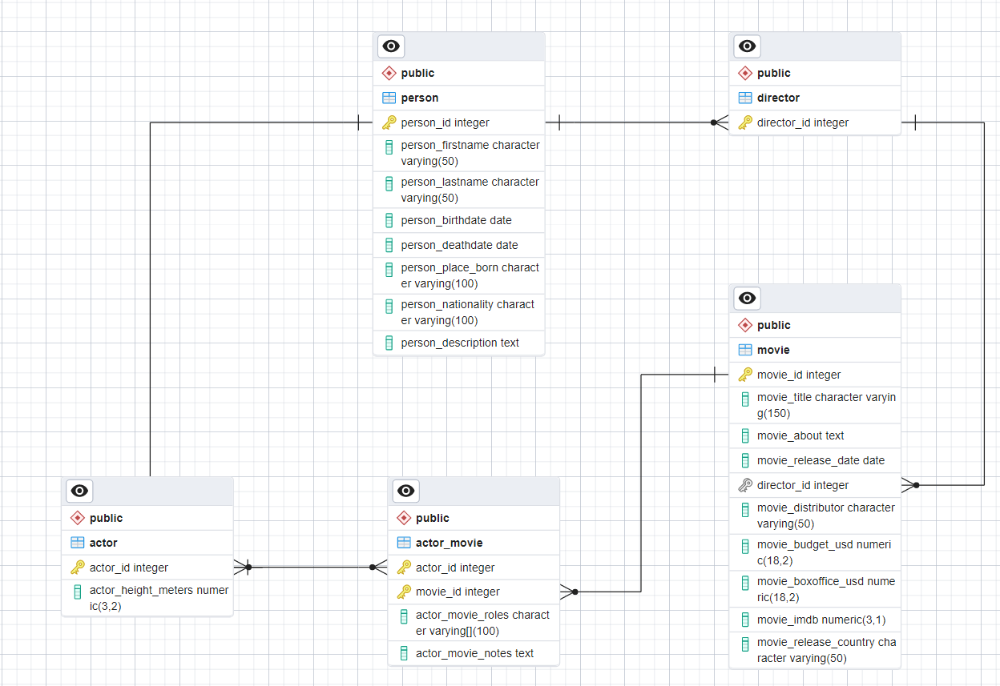

# Teachers2IT: Курс з «Основ баз даних на прикладі PostgreSQL» by Kharkiv IT Cluster

Homework for Teachers2IT PostgreSQL training by Kharkiv IT Cluster.

## Homework 01

- Created movies database

- Handwritten SQL [scripts](main.py)

- SQL generated [scripts](movies.sql)
