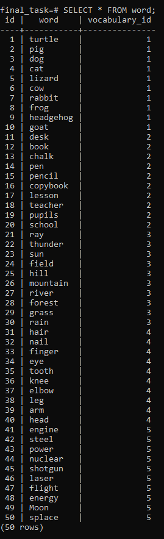

# Контрольна робота
#### Виконав: Копп Андрій Михайлович (DrivEd: @user109954)
#### Telegram: @andriimk10

### 1. Створити таблицю з наступними данними:

```
+----+--------+----------------+------------------+--------+
| id | name   | pwd            | email            | gender |
+----+--------+----------------+------------------+--------+
|  1 | Vasya  | 21341234qwfsdf | mmm@mmail.com    | m      |
|  2 | Alex   | 21341234       | mmm@gmail.com    | m      |
|  3 | Alexey | qq21341234Q    | alexey@gmail.com | m      |
|  4 | Helen  | MarryMeeee     | hell@gmail.com   | f      |
|  5 | Jenny  | SmakeMyb       | eachup@gmail.com | f      |
|  6 | Lora   | burn23         | tpicks@gmail.com | f      |
+----+--------+----------------+------------------+--------+
```

#### Solution:
```sql
CREATE DATABASE final_task;

\c final_task

CREATE TABLE account (
    id SERIAL PRIMARY KEY, 
    name VARCHAR(50) NOT NULL, 
    pwd VARCHAR(32) NOT NULL, 
    email VARCHAR(100) NOT NULL, 
    gender CHAR(1) NOT NULL
);

INSERT INTO account (name, pwd, email, gender) VALUES 
('Vasya', '21341234qwfsdf', 'mmm@mmail.com', 'm'),
('Alex', '21341234', 'mmm@mmail.com', 'm'),
('Alexey', 'qq21341234Q', 'alexey@mmail.com', 'm'),
('Helen', 'MarryMeeee', 'hell@mmail.com', 'f'),
('Jenny', 'SmakeMyb', 'eachup@mmail.com', 'f'),
('Lora', 'burn23', 'tpicks@mmail.com', 'f');
```

#### Result:


### 2. Відобразити данні у приведеному нижче вигляді, зверніть увагу на `he` та `she`:

```
+-----------------------------------------------+
| info                                          |
+-----------------------------------------------+
| This is Vasya, he has email mmm@mmail.com     |
| This is Alex, he has email mmm@gmail.com      |
| This is Alexey, he has email alexey@gmail.com |
| This is Helen, she has email hell@gmail.com   |
| This is Jenny, she has email eachup@gmail.com |
| This is Lora, she has email tpicks@gmail.com  |
+-----------------------------------------------+
```

#### Solution:
```sql
SELECT 'This is ' || name || (CASE gender 
        WHEN 'm' 
            THEN ' he' 
        ELSE ' she' 
    END) || ' has email ' || email AS info
FROM account;
```

#### Result:


### 3. Відобразити данні у приведеному нижче вигляді:

```
+---------------------+
| Gender information: |
+---------------------+
| We have 3 boys!     |
| We have 3 girls!    |
+---------------------+
```

#### Solution:
```sql
SELECT 'We have ' || COUNT(gender) || (CASE gender 
        WHEN 'm' 
            THEN ' boys!' 
        ELSE ' girls!' 
    END) AS "Gender information"
FROM account
GROUP BY gender;
```

#### Result:


### 4. Створити та заповнити структуру данних для зберігання словників та слів у них:

```sql
create table word (id serial, word varchar(255), vocabulary_id integer);

create table vocabulary (id serial, name varchar(255), info text);

```

```sql
INSERT INTO vocabulary
	(name)
VALUES
	('animals'),
	('school'),
	('nature'),
	('human'),
	('SF');

INSERT INTO word
	(word, vocabulary_id)
VALUES
	('turtle', 1),
	('pig', 1),
	('dog', 1),
	('cat', 1),
	('lizard', 1),
	('cow', 1),
	('rabbit', 1),
	('frog', 1),
	('headgehog', 1),
	('goat', 1);

INSERT INTO word
	(word, vocabulary_id)
VALUES
	('desk', 2),
	('book', 2),
	('chalk', 2),
	('pen', 2),
	('pencil', 2),
	('copybook', 2),
	('lesson', 2),
	('teacher', 2),
	('pupils', 2),
	('school', 2);

INSERT INTO word
	(word, vocabulary_id)
VALUES
	('ray', 3),
	('thunder', 3),
	('sun', 3),
	('field', 3),
	('hill', 3),
	('mountain', 3),
	('river', 3),
	('forest', 3),
	('grass', 3),
	('rain', 3);

INSERT INTO word
	(word, vocabulary_id)
VALUES
	('hair', 4),
	('nail', 4),
	('finger', 4),
	('eye', 4),
	('tooth', 4),
	('knee', 4),
	('elbow', 4),
	('leg', 4),
	('arm', 4),
	('head', 4);

INSERT INTO word
	(word, vocabulary_id)
VALUES
	('engine', 5),
	('steel', 5),
	('power', 5),
	('nuclear', 5),
	('shotgun', 5),
	('laser', 5),
	('flight', 5),
	('energy', 5),
	('Moon', 5),
	('splace', 5);

```

#### Result:
```sql
\d
```

```sql
SELECT * FROM word;
```

```sql
SELECT * FROM vocabulary;
```


### 5. Отримайте результат:
```
+---------+-------+
| name    | words |
+---------+-------+
| animals |    10 |
| school  |    10 |
| nature  |    10 |
| human   |    10 |
| SF      |    10 |
+---------+-------+
5 rows in set (0.01 sec)
```

#### Solution:
```sql
SELECT name, words FROM (
    SELECT vocabulary.id, vocabulary.name, COUNT(word.id) AS words
    FROM vocabulary INNER JOIN word 
        ON vocabulary.id = word.vocabulary_id
    GROUP BY vocabulary.id, vocabulary.name
    ORDER BY vocabulary.id
) AS source;
```

* Remark: I have used the sub-query to make the output look like in the given task.

#### Result:

